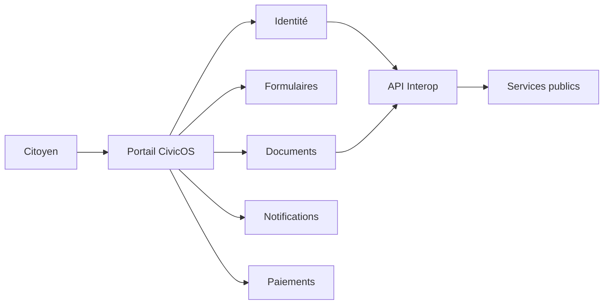

# HashCode CivicOS

> Infrastructure open source pour rendre les services publics numériques plus accessibles, interopérables et résilients.

**Domaine:** Web & Software Engineering · **Programme:** HashCode Global Impact · **Statut:** Research / MVP discovery

## Problème
Les démarches publiques peuvent rester fragmentées, manuelles, difficiles d'accès et peu interopérables.

## Vision
Construire des briques réutilisables pour l'identité, les formulaires, les documents, la vérification, les notifications, les paiements, les signatures et les API.

## Cartographie

## MVP
- demandes administratives ; documents vérifiables ; notifications ; API ; contrôle d'accès ; audit.

## Principes
Mobile-first, faible connectivité, privacy-by-design, security-by-design, accessibilité et interopérabilité.

## Impact
Temps d'obtention, taux de réussite, coût opérationnel, couverture et satisfaction des usagers.

## Documentation
Architecture, données, sécurité, impact et roadmap seront maintenus dans `docs/`.

## Contribuer
Voir le programme central : https://github.com/HashCode-Reboot/hashcode-contributors

**Doctrine HashCode:** *Build for Africa. Scale for Humanity.*