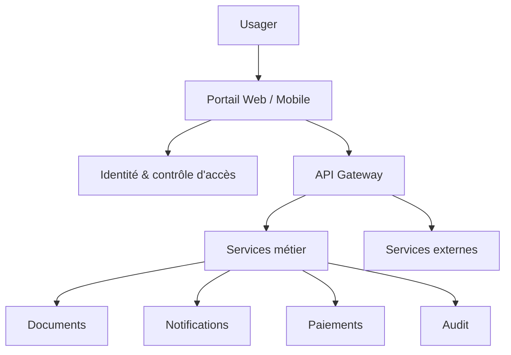

# Architecture — CivicOS

## Vue système

## Principes techniques

- API-first et contrats versionnés.
- PostgreSQL pour les données transactionnelles.
- File/object storage pour les documents avec chiffrement.
- Observabilité et journal d'audit.
- Mode dégradé pour les zones à faible connectivité.
- Permissions minimales et séparation des responsabilités.

## Données sensibles

L'identité, les documents et les journaux nécessitent minimisation, chiffrement, contrôle d'accès et politique de rétention documentée.

## Évolution

Le MVP doit rester modulaire afin que chaque service public puisse intégrer uniquement les briques dont il a besoin.